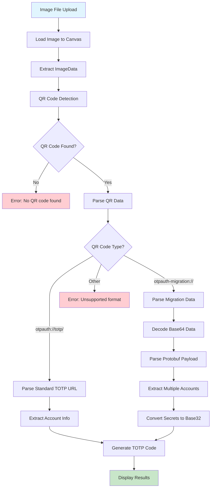
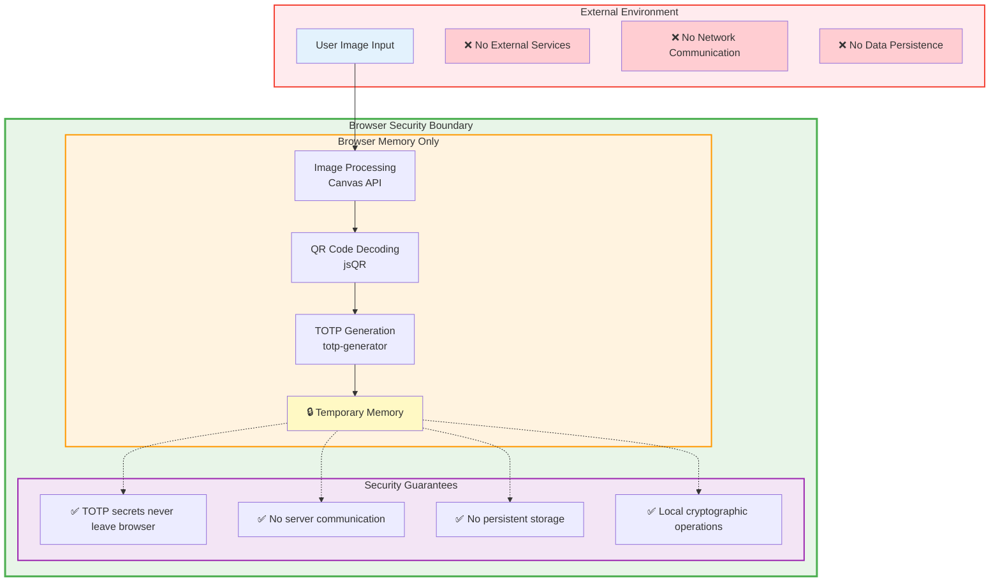

# TOTP QR Code Decoder

A modern, fully client-side web application for decoding TOTP (Time-based One-Time Password) QR codes from images. Everything runs securely in your browser!

## 🌐 Use it online
### [https://totp-decoder.vercel.app](https://totp-decoder.vercel.app/)

*Or deploy your own copy:* 
[](https://vercel.com/new/clone?repository-url=https://github.com/VizzleTF/TOTP_decoder)

## Features

- 🔐 **Fully Client-Side**: All processing in browser - no data sent to servers
- 📷 **QR Code Decoding**: Decode TOTP QR codes from images and screenshots
- 📱 **Google Authenticator Migration**: Support for migration QR codes (otpauth-migration://)
- ⏰ **Live TOTP Generation**: Generate current TOTP codes in real-time
- 👥 **Multiple Accounts**: Handle multiple accounts from migration QR codes
- 📁 **Drag & Drop**: Simply drag images or paste with Ctrl+V (Cmd+V on Mac)
- 📋 **One-click Copy**: Copy TOTP codes and OTP Auth URLs
- 📱 **Mobile Friendly**: Responsive design for all devices

## Usage

1. **Upload QR code**: Drag & drop image, click to select, or paste with Ctrl+V
2. **View results**: Automatic decoding shows account info, current TOTP codes, and OTP Auth URLs
3. **Copy codes**: Click copy buttons for TOTP codes or URLs
4. **Migration support**: Multiple accounts from Google Authenticator migration QR codes

## Supported Formats

**Images**: PNG, JPG, JPEG, BMP, TIFF, WebP

**QR Codes**:
- `otpauth://totp/` - Standard TOTP format
- `otpauth-migration://` - Google Authenticator migration format
- Parameters: secret, issuer, algorithm (SHA1/SHA256/SHA512), digits (6/8), period

## Project Structure

```
TOTPdecode/
├── web/                    # React web application
│   ├── src/
│   │   ├── App.jsx         # Main React component
│   │   ├── totpDecoder.js  # Core TOTP decoding logic
│   │   ├── otpMigration.js # Migration protobuf decoder
│   │   ├── main.jsx        # React entry point
│   │   └── index.css       # Global styles
│   ├── public/
│   │   └── vite.svg        # Vite logo
│   ├── package.json        # Web app dependencies
│   ├── vite.config.js      # Vite configuration
│   ├── tailwind.config.js  # Tailwind CSS config
│   ├── postcss.config.js   # PostCSS config
│   └── index.html          # HTML template
├── package.json            # Root package.json
├── vercel.json             # Deployment config
├── .vercelignore           # Vercel ignore rules
├── test_qr_code.png        # Test QR code image
└── README.md               # Project documentation
```

## Data Processing Flow

The application implements a pipeline architecture for processing QR code images through to TOTP code generation:



## Security Model

The application implements a zero-trust security model where all sensitive operations occur exclusively within the user's browser environment:

