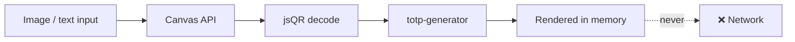

# TOTP QR Code Decoder

[](https://deepwiki.com/VizzleTF/totp_decoder)

Decode authenticator QR codes into live one-time passwords. Fully client-side — nothing is uploaded.

### 🌐 [totp.onlyyaml.dev](https://totp.onlyyaml.dev/)


## Features

- 🔐 **Fully client-side** — all processing happens in your browser, no server communication, no storage
- 📋 **Paste anything** — QR image, `otpauth://` link, or raw Base32 secret, via Ctrl+V anywhere on the page
- 📷 **Drag & drop** — PNG, JPG, JPEG, GIF, BMP, WebP
- 📱 **Migration QR support** — multiple accounts from Google Authenticator `otpauth-migration://` exports
- ⏰ **Live codes** — TOTP regenerates in real time with a remaining-time indicator
- 🔁 **Re-encode** — each result shows a scannable QR (click to enlarge), its Base32 secret, and its OTP Auth URL
- 🖱️ **One-click copy** — codes, secrets, and URLs
- 🌓 **Light & dark** — follows the system theme, respects `prefers-reduced-motion`
- 🌍 **i18n** — English and Russian

## Usage

1. Drop or paste a QR image, an `otpauth://` link, or a Base32 secret
2. Read the decoded accounts: issuer, account, current code, secret, OTP Auth URL
3. Click any value to copy it, or click the QR tile to enlarge it and scan into another authenticator

## Supported input

| Type | Format |
| --- | --- |
| Standard TOTP | `otpauth://totp/...` |
| Migration | `otpauth-migration://offline?data=...` |
| Raw secret | Base32 (≥16 chars, spaces and dashes tolerated) |
| Images | PNG, JPG, JPEG, GIF, BMP, WebP |

Parameters honored: `secret`, `issuer`, `algorithm` (SHA1/SHA256/SHA512), `digits` (6/8), `period`.

## Security model

Zero-trust by construction: secrets never leave the browser.


```mermaid
flowchart LR
    U[Image / text input] --> IMG[Canvas API]
    IMG --> QR[jsQR decode]
    QR --> TOTP[totp-generator]
    TOTP --> UI[Rendered in memory]
    UI -.->|never| NET[❌ Network]
```

No server communication, no persistent storage, all cryptographic operations local.

## Development

```bash
npm install     # installs web/ dependencies
npm run dev     # vite dev server on :3000
npm run build   # production build to web/dist
```

## Support

[Buy Me a Coffee](https://www.buymeacoffee.com/vizzletf) · [Boosty](https://boosty.to/vizzletf/donate)

## License

MIT
